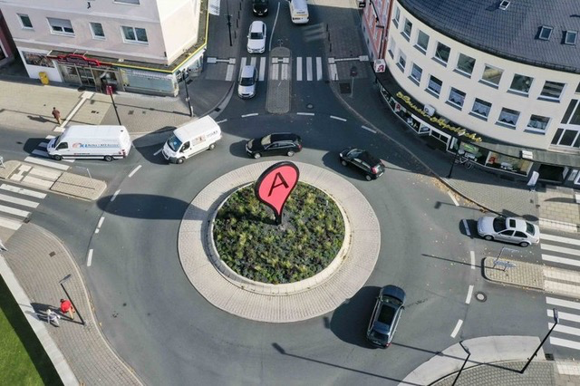

# SS25 Sabotage

## Week 1 - April 14th

Hey everybody,
it was great meeting you all and we're excited to start working together on your projects in the upcoming months.
we hope you had a nice easter weekend. In this repository, we will give regular updates on the class, as well as weekly assignments and a short summary. Those you can find in the weeks folder, together with the slides and sometimes some reading material and references.  
---  
### Research Phase Presentations  
  
This week we kicked off the project and gave a spotty overview of the potential contextual background for the class.  
The next weeks will be about determining a general theme for your project and developing your project hypothesis and statement.  
To jumpstart the research, we will distribute uncovering potential project directions. The following topics should open up the termin and introduce various interpretations:  
  
- semantics of sabotage
- sabotaging systems
- bureaucracy and sludge
- subversion and spycraft
- self-sabotage
- epistemological sabotage
- industrial sabotage and hybrid warfare  
  
The first task is to do a deep research into one of these topics and present it to the class in a 15 minute presentation. Remember, that the general basics shouldn't be covered in every presentation and the purpose of this exerise is achieving depth. 
Focus on finding interesting design related phenomena, that offer entry points for the project related research.
This is the schedule for the presentations:  
  
**Monday April 28th:**  
Philipp, Freddy, Mona, Dachi  
**Tuesday April 29th:**  
Miriam (H.), Leon, Max, Linus  

Feel free to come up with another sabotage-related topic, if you had something else in mind.

**Important:** Coordinate so that the topics are evenly distributed and there is not a lot of overlap.
Also of note: The topic should reflect your interest, but shouldn't necessarily determine your project direction yet.
Collect all your references to make them accessible to everyone after the presentations. 
---
### GitHub peer learning  
  
You can all publish on this repository. To accomplish this you can either watch a tutorial on how to do it (I recommend using Visual Study Code as an editor) or ask one of your class mates to show you. It's fairly simple once you get the gist and a seamless way to keep a journal and share insights.  
---
### Mini Excursion  
  
We are planning to visit the event [**Digital Interventions. Bodies, Infrastructures, Politics**](https://www.sfb-intervenierende-kuenste.de/veranstaltungen/jahrestagung2025.html) at HAU on the 9th and 10th of May. 
  
We will announce it again in class, but please check your availability.  
--- 
### Day two consultations  
We will start with small group discussions in which you can already start mapping out the space you want to further research. Individually prepare your current research for us to feedback for Tuesday afternoon from two with a couple of slides (roughly put together inspiration, themes and sketches on slides that can be presented on a laptop (only headlines and images)).  
---
### Preliminary schedule

**Monday April 28th**  
10 - 12 Research presentations with breaks - please be on time.  
12 - 13 Break  
13 - 15 Research Presentations with breaks - please return on time.  
from 15 Group assignments  
  
  
**Tuesday April 28th**  
10 - 11 Input (either coding or theory)  
11 - 13 Working  
from 14 Working & Consultations  

